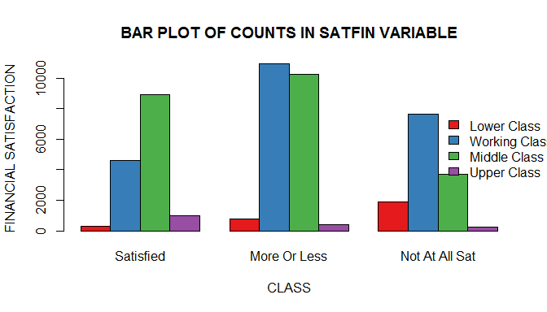
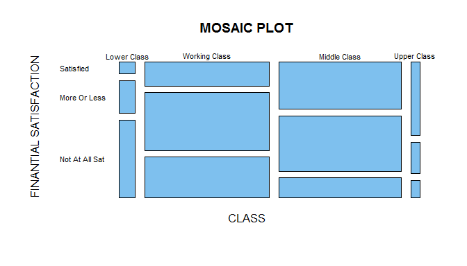

# Statistical inference with the GSS data

## Setup

### Load packages


```r
library(ggplot2)
library(dplyr)
library(statsr)

library(RColorBrewer)
```

### Load data


```r
load("gss.Rdata")
```


* * *

## Part 1: Data
The data is collected by the General Social Survey (GSS). They gathered data on contemporary American society to monitor and explain trends and constants in attitudes, behaviors, and attributes. Data has been collected for more than four decades: 1972-2012
Survey data questions cover a diverse range of issues including national spending priorities, marijuana use, crime and punishment, race relations, quality of life, confidence in institutions, and sexual behavior. 
Random sampling was used at various identified areas like the ones mentioned above which means stratified sampling used and 114 variables were collected for a total of 57061 cases. 
The method on the scope of inference: generalizability. Population of interest are the US adult residents at households. Therefore, it can be generalized to the population as it is an observational study using random sampling of a large number of cases.  


* * *

## Part 2: Research question
There is relation between Subjective class every case self-identifies and their satisfaction about it. Money does not buy happiness, but would still keep us satisfied?
I think this is a really interesting question because we might often think/hear that the upper class would be very happy since they have covered the basic needs, but I want to show: there is no relation between the class and the satisfaction level.


* * *

## Part 3: Exploratory data analysis

I have selected two variables from GSS: CLASS and SATFIN, both of the categorical data. 
First will show summary of individual variables and then the relationship between the two variables. Mosaic plot would be useful here. 


```r
gss2 <- subset(gss, class != "No Class")

gss2 %>% filter(class != "NA") %>% group_by(class) %>% summarise(count=n()) 
```

```
## # A tibble: 4 x 2
##           class count
##          <fctr> <int>
## 1   Lower Class  3147
## 2 Working Class 24458
## 3  Middle Class 24289
## 4   Upper Class  1741
```

```r
gss2 %>% filter(satfin != "NA") %>% group_by(satfin) %>% summarise(count=n()) 
```

```
## # A tibble: 3 x 2
##           satfin count
##           <fctr> <int>
## 1      Satisfied 14795
## 2   More Or Less 22402
## 3 Not At All Sat 13442
```

Just removing the NA from our variables. 


```r
table(gss2$satfin, gss2$class)[, -(which(colSums(table(gss2$satfin, gss2$class)) == 0))]
```

```
##                 
##                  Lower Class Working Class Middle Class Upper Class
##   Satisfied              299          4594         8913         989
##   More Or Less           787         10935        10260         420
##   Not At All Sat        1876          7660         3679         227
```


```r
barplot(table(gss2$satfin), beside=TRUE, xlab="Satisfaction with Financial Situation", ylab="", main="BAR PLOT OF COUNTS IN SATFIN VARIABLE", col=brewer.pal(nrow(table(gss2$satfin)), "Greens"))
```

<!-- -->

It is not hard to see that the easiest answer to this question about financial satisfaction is MORE OR LESS, I would say that there are a lot of thoughts behind this simple answer. Still it gives us an interesting perspective of SATISFIED and NOT AT ALL SATISFIED: they seem to be alike. Extremes are somehow similar in their counts. 


```r
satfin_class = table(gss2$class, gss2$satfin)
satfin_class = satfin_class[apply(satfin_class[, -1], 1, function(x) !all(x==0)), ]

barplot(satfin_class, beside=TRUE, xlab="CLASS", legend.text=TRUE, ylab="FINANCIAL SATISFACTION", main="BAR PLOT OF COUNTS IN SATFIN VARIABLE",args.legend=list(x = "right", bty = "n", inset=c(-.1, 0)), col=brewer.pal(nrow(satfin_class), "Set1"))
```

<!-- -->

We can get that the Working and the Middle class are providing the more information in the graphic. Overall the Middle class is the more satisfied. Where the working class is the least satisfied. 


```r
mosaicplot(satfin_class, color= "skyblue2", main = "MOSAIC PLOT", xlab = "CLASS", ylab = "FINANTIAL SATISFACTION", off = 10, las = 1)
```

<!-- -->

From the Mosaic Plot we can have the visual representation of the proportions of each variable. Again, the Upper class is the most satisfied and the Lower class is the least satisfied. Though they do not represent the gross of the plot. Middle and Working class provide more data to the graphic. 


* * *

## Part 4: Inference

- Hypothesis: We are to test the hypothesis that Class and Financial Satisfaction are associated at 5% significance level. Hence, 
Ho: Class and Financial Satisfaction are independent
Ha: Class and Financial Satisfaction are dependent
- Conditions checkup: 
Independence: random sampling was done for this survey, if sampling without replacement, n<10% of population. Each case for the study provides data to one cell in the table. 
Sample/Skew: each cell must have at least 5 expected cases. 

We will use statistical inference since the conditions are met for the hypothesis testing. 
As the two variables are categorical and at least one has more than 2 levels and we are testing for independence, we will be using Chi-square for Independence Test. 

Conditions were met: sample data are counts, sample data is independent as random sampling is used, sample size is large enough and is also less than 10% of the US total population. Each case only contributes to one cell. Each cell has at least 5 expected cases as it is shown below.


```r
expected_count = chisq.test(satfin_class)
expected_count$expected
```

```
##                
##                 Satisfied More Or Less Not At All Sat
##   Lower Class    865.3960     1310.348       786.2557
##   Working Class 6775.0401    10258.496      6155.4639
##   Middle Class  6676.5801    10109.412      6066.0081
##   Upper Class    477.9838      723.744       434.2722
```

```r
chisq.test(satfin_class)
```

```
## 
## 	Pearson's Chi-squared test
## 
## data:  satfin_class
## X-squared = 5668, df = 6, p-value < 2.2e-16
```

Since p-value is less than 0.0000000000000002 and it is less than the 0.05 significance level, we reject Ho.
Therefore, this means that there is indeed dependence between class and financial satisfaction. Which would make some sort of sense. 

There could be many factors to have this dependence. A personal thought is that the Maslow pyramid gives a raw idea that once we cover our basic needs and we have little time to think we get into a comfort zone that could be linked to a good satisfaction level. 

Being in the upper class could be that you might have time to think, hence time to think that you might need a lot of more things beyond your basic needs, like traveling more, buying a bigger house, going to a better dinning place. Could be true, could be not. But it is just a thought.

Being part myself of the middle/working class, I consider myself satisfied with what I have and I enjoy what I do. Enjoy my family and enjoy my friends. So far, I think I have everything. Could have more but maybe I have no time to think in other things. 

Be happy and enjoy your life. Live with no regrets. 
