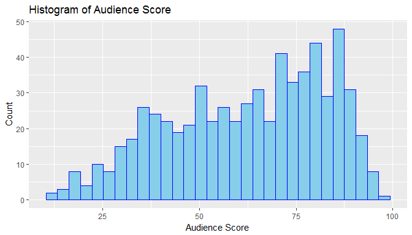
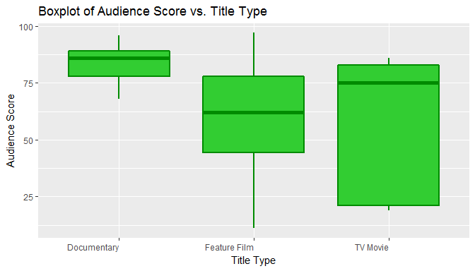
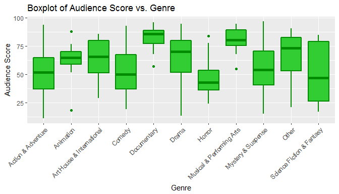
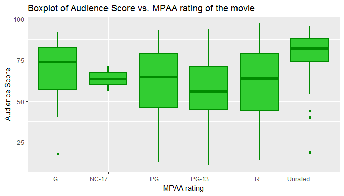
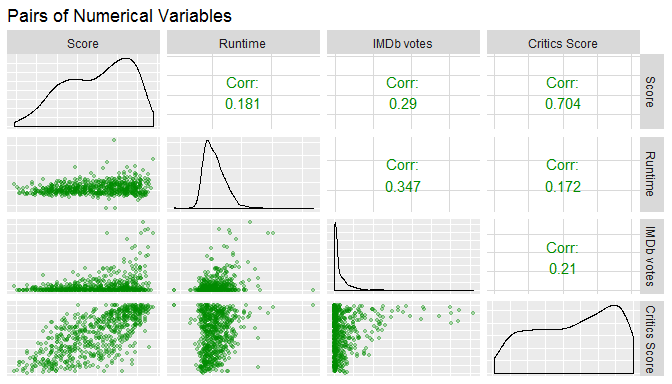
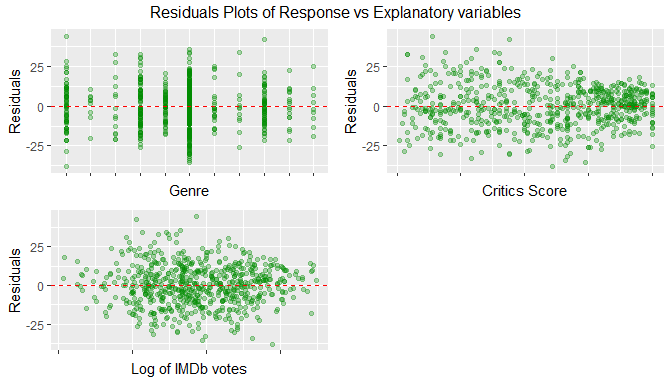
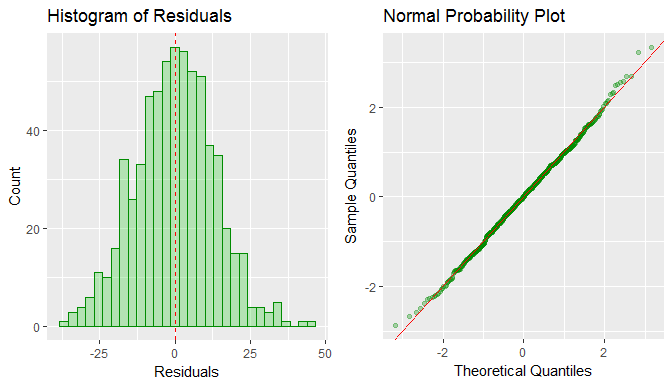
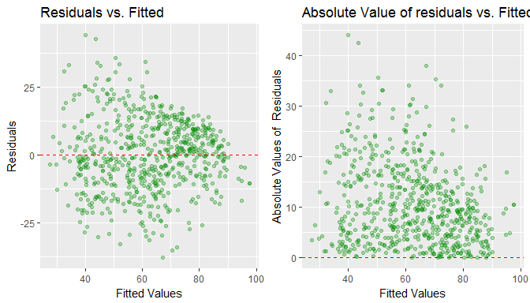
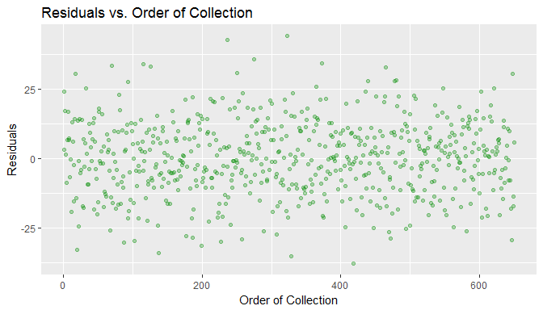

# Modeling and prediction for movies

## Setup

### Load packages


```r
library(ggplot2)
library(dplyr)
library(statsr)
library(gridExtra)
library(broom)
library(GGally)
```

```
## Warning: package 'GGally' was built under R version 3.4.2
```

### Load data


```r
load("movies.Rdata")
```

#### ABOUT ROTTEN TOMATOES®

Rotten Tomatoes® and the Tomatometer® rating is the most trusted measurement of quality entertainment. As the leading online aggregator of movie and TV show reviews from professional critics, Rotten Tomatoes offers the most comprehensive guide to what's fresh. The world famous Tomatometer rating represents the percentage of positive professional reviews for films and TV shows and is used by millions every day, to help with their entertainment viewing decisions. Rotten Tomatoes designates the best reviewed movies and TV shows as Certified FreshT. That accolade is awarded with Tomatometer ratings of 75% and higher, and a required minimum number of reviews. Weekly Rotten Tomatoes podcasts can be found on RottenTomatoes.com, iTunes, Soundcloud and Stitcher, and Rotten Tomatoes' entertainment experts make regular TV and radio appearances across the US.

In 2016, Flixster and Rotten Tomatoes became part of Fandango's portfolio of digital properties, serving moviegoers and entertainment fans.


###### WHAT IS THE TOMATOMETER®?

The Tomatometer rating - based on the published opinions of hundreds of film and television critics - is a trusted measurement of movie and TV programming quality for millions of moviegoers.

The Tomatometer rating represents the percentage of professional critic reviews that are positive for a given film or television show.

Back in the days of the open theaters, when a play was particularly atrocious, the audience expressed their dissatisfaction by not only booing and hissing at the stage, but throwing whatever was at hand -- vegetables and fruits included.

A good review is denoted by a fresh red tomato. In order for a movie or TV show to receive an overall rating of Fresh, the reading on the Tomatometer for that movie must be at least 60%.
A bad review is denoted by a rotten green tomato splat (59% or less).
To receive a Certified Fresh rating a movie must have a steady Tomatometer rating of 75% or better. Movies opening in wide release need at least 80 reviews from Tomatometer Critics (including 5 Top Critics). Movies opening in limited release need at least 40 reviews from Tomatometer Critics (including 5 Top Critics). A TV show must have a Tomatometer Score of 75% or better with 20 or more reviews from Tomatometer Critics (including 5 Top Critics). If the Tomatometer score drops below 70%, then the movie or TV show loses its Certified Fresh status. In some cases, the Certified Fresh designation may be held at the discretion of the Rotten Tomatoes editorial team.


###### WHAT IS THE AUDIENCE SCORE?
The Audience rating, denoted by a popcorn bucket, is the percentage of all Flixster.com and RottenTomatoes.com users who have rated the movie or TV Show positively.

The full popcorn bucket means the movie received 3.5 stars or higher by Flixster and Rotten Tomatoes users.
The tipped over popcorn bucket means the movie received less than 3.5 stars by Flixster and Rotten Tomatoes users.
The plus sign will appear for movies that do not have audience ratings or reviews. The percentage you see associated with this icon is the percentage of users who added the movie to their Want-to-See list. 

Source: [https://www.rottentomatoes.com/about/](https://www.rottentomatoes.com/about/)


#### WHAT IS IMDB?
IMDb started in 1990 as a hobby project by an international group of movie and TV fans (see history).

IMDb is now the world's most popular and authoritative source for movie, TV and celebrity content. We offer a searchable database of more than 185 million data items including more than 3.5 million movies, TV and entertainment programs and 7 million cast and crew members.

Source: [http://www.imdb.com/help/show_leaf?about&ref_=hlp_brws](http://www.imdb.com/help/show_leaf?about&ref_=hlp_brws)

* * *

## Part 1: Data
The data given is to be derived from an observational study. The data set is 651 randomly sampled movies produced and released from 1970 - 2014 (released in theaters). 
Based on IMDb website, there are 4,593,821 titles from 1874 - 2115 (I think this is a typo from the website, since I am referencing an official website I will keep as it is, though I think it is up to 2015) (http://www.imdb.com/stats).
But only 88,957	are movies. Therefore the 10% condition (88,957 * 0.1 = 8895.7) is met. 
Since sampling size is large enough and less than 10% of population, it can assume that the random sampling is conducted. We can conclude that the sample is generalizable to the entire population.

The data shown cannot be used to establish causality relation between the variables of interest. There was no random assignment to the explanatory and independent variables.


* * *

## Part 2: Research question
##### What makes a movie popular?
Since we are including two related websites with limited variables. We will try to answer this question basing our analysis on the IMDb rating and the audience score. 
It is a well-known fact that good reviews on IMDb and/or Rotten Tomatoes are related with high earnings for a movie. This "earnings" variable is not included but would be the best way to know if a movie was popular. Considering our variables, we need to rephrase our question:

#### Can we predict if a movie is popular by considering its type, genre, runtime, MPAA rating, number of IMDb votes and critics score?


* * *

## Part 3: Exploratory data analysis
##### Response variables
* imdb_rating: Rating on IMDB
* audience_score: Audience score on Rotten Tomatoes

##### Explanatory variables
* title_type: Type of movie (Documentary, Feature Film, TV Movie)
* genre: Genre of movie (Action & Adventure, Comedy, Documentary, Drama, Horror, Mystery & Suspense, Other)
* runtime: Runtime of movie (in minutes)
* mpaa_rating: MPAA rating of the movie (G, PG, PG-13, R, Unrated)
* imdb_num_votes: Number of votes on IMDB
* critics_score: Critics score on Rotten Tomatoes

First, we'll check for correlation between our response variables. 


```r
cor(movies$imdb_rating, movies$audience_score)
```

```
## [1] 0.8648652
```

As the correlation is pretty high, we will drop the "Rating on IMDb" (*imdb_rating *) and will keep the Audience Score on Rotten Tomatoes (*audience_score*) as the unique response variable. 

Create a sub dataset from the entire movies by selecting only the variables we are considering in the proper order as explanatory and response ones. 


```r
movies_2 <- movies %>% select(audience_score, title_type, genre, runtime, mpaa_rating, imdb_num_votes, critics_score) %>% filter(runtime != "NA")
sapply(movies_2, function(x) sum(is.na(x)))
```

```
## audience_score     title_type          genre        runtime    mpaa_rating 
##              0              0              0              0              0 
## imdb_num_votes  critics_score 
##              0              0
```

```r
movies_2
```

```
## # A tibble: 650 x 7
##    audience_score   title_type       genre runtime mpaa_rating
##             <dbl>       <fctr>      <fctr>   <dbl>      <fctr>
##  1             73 Feature Film       Drama      80           R
##  2             81 Feature Film       Drama     101       PG-13
##  3             91 Feature Film      Comedy      84           R
##  4             76 Feature Film       Drama     139          PG
##  5             27 Feature Film      Horror      90           R
##  6             86  Documentary Documentary      78     Unrated
##  7             76 Feature Film       Drama     142       PG-13
##  8             47 Feature Film       Drama      93           R
##  9             89  Documentary Documentary      88     Unrated
## 10             66 Feature Film       Drama     119     Unrated
## # ... with 640 more rows, and 2 more variables: imdb_num_votes <int>,
## #   critics_score <dbl>
```

Plot a histogram of the response variable. 


```r
ggplot(movies_2, aes(x = movies_2$audience_score)) + geom_histogram(col = "blue", fill = "skyblue") + xlab("Audience Score") + ylab("Count") + ggtitle("Histogram of Audience Score")
```

```
## `stat_bin()` using `bins = 30`. Pick better value with `binwidth`.
```

<!-- -->

```r
summary(movies_2$audience_score)
```

```
##    Min. 1st Qu.  Median    Mean 3rd Qu.    Max. 
##   11.00   46.00   65.00   62.35   80.00   97.00
```

The distribution of the Audience Score on Rotten Tomatoes variable looks like left skewed and might be still considered unimodal/multimodal.

We need to visualize how our categorical variables behave with the response variable. 


```r
p3_title <- ggplot(movies_2, aes(x = title_type, y = audience_score)) + geom_boxplot(color="green4", fill = "limegreen", size=1) + xlab("Title Type") + ylab("Audience Score") + ggtitle("Boxplot of Audience Score vs. Title Type") + theme(axis.text.x=element_text(hjust=1, vjust=0))
p3_title
```

<!-- -->

```r
p3_genre <- ggplot(movies_2, aes(x = genre, y = audience_score)) + geom_boxplot(color="green4", fill = "limegreen", size=1) + xlab("Genre") + ylab("Audience Score") + ggtitle("Boxplot of Audience Score vs. Genre") + theme(axis.text.x=element_text(angle=45, hjust=1))
p3_genre
```

<!-- -->

```r
p3_mpaa <- ggplot(movies_2, aes(x = mpaa_rating, y = audience_score)) + geom_boxplot(color="green4", fill = "limegreen", size=1) + xlab("MPAA rating") + ylab("Audience Score") + ggtitle("Boxplot of Audience Score vs. MPAA rating of the movie") +  theme(axis.text.x=element_text(hjust=1, vjust=0))
p3_mpaa
```

<!-- -->

It seems that all three categorical variables (*title_type*, *genre* and *mpaa_rating*) and the response variable *audience_score* are associated. 

Now, we need to check scatterplots for numerical variables and their behavior with the response variable.


```r
ggpairs(movies_2, columns = c(1, 4, 6, 7), axisLabels = "none", columnLabels = c("Score", "Runtime", "IMDb votes", "Critics Score"), title = "Pairs of Numerical Variables", upper = list(continuous =  wrap("cor", color = "green4")), lower = list(continuous = wrap("points", alpha = 0.3, color = "green4", fill = "limegreen", size = 1)))
```

<!-- -->

As we can see, the correlations between predictors are not high at all, which means that is good when modeling with linear regression since it would avoid collinearity. 

We note that the distribution of *imbd_num_votes* variable seem strongly right skewed, so it will be transformed into a new variable using natural log.


```r
movies_2 <- movies_2 %>% mutate(log_imdb_num_votes = log(imdb_num_votes)) %>% select(-imdb_num_votes)
```

* * *

## Part 4: Modeling
##### Baseline Model
Ready to create the first linear model to predict the response variable.
We will include all the variables so far: *title_type*, *genre*, *runtime*, *mpaa_rating*, *critics_score*, *log_imdb_num_votes*.


```r
lm_1 <- lm(audience_score ~ title_type + genre + runtime +  mpaa_rating + log_imdb_num_votes + critics_score, data = movies_2)
summary(lm_1)
```

```
## 
## Call:
## lm(formula = audience_score ~ title_type + genre + runtime + 
##     mpaa_rating + log_imdb_num_votes + critics_score, data = movies_2)
## 
## Residuals:
##     Min      1Q  Median      3Q     Max 
## -35.991  -8.553   0.431   8.812  43.223 
## 
## Coefficients:
##                                Estimate Std. Error t value Pr(>|t|)    
## (Intercept)                     9.59899    7.09369   1.353 0.176487    
## title_typeFeature Film         -4.51276    5.03544  -0.896 0.370489    
## title_typeTV Movie             -8.51101    7.80965  -1.090 0.276216    
## genreAnimation                  3.32290    5.18935   0.640 0.522191    
## genreArt House & International 11.40858    4.07229   2.802 0.005243 ** 
## genreComedy                     1.92783    2.23025   0.864 0.387699    
## genreDocumentary               15.16845    5.31083   2.856 0.004430 ** 
## genreDrama                      5.76825    1.97690   2.918 0.003651 ** 
## genreHorror                    -6.11509    3.32833  -1.837 0.066640 .  
## genreMusical & Performing Arts 15.34047    4.57079   3.356 0.000838 ***
## genreMystery & Suspense        -2.34502    2.48355  -0.944 0.345420    
## genreOther                      5.39951    3.79923   1.421 0.155751    
## genreScience Fiction & Fantasy -5.23928    4.74244  -1.105 0.269684    
## runtime                         0.01987    0.03036   0.655 0.512947    
## mpaa_ratingNC-17               -9.37904   10.07975  -0.930 0.352478    
## mpaa_ratingPG                  -2.54151    3.66871  -0.693 0.488719    
## mpaa_ratingPG-13               -6.21006    3.79134  -1.638 0.101930    
## mpaa_ratingR                   -3.27684    3.64302  -0.899 0.368738    
## mpaa_ratingUnrated             -1.20407    4.18788  -0.288 0.773814    
## log_imdb_num_votes              3.21446    0.38749   8.296 6.58e-16 ***
## critics_score                   0.39462    0.02242  17.601  < 2e-16 ***
## ---
## Signif. codes:  0 '***' 0.001 '**' 0.01 '*' 0.05 '.' 0.1 ' ' 1
## 
## Residual standard error: 13.3 on 629 degrees of freedom
## Multiple R-squared:  0.5813,	Adjusted R-squared:  0.568 
## F-statistic: 43.66 on 20 and 629 DF,  p-value: < 2.2e-16
```

##### Model selection
Now we proceed with the variable selection.
To select the best model answering the research question, we will perform a forward p-value selection. 
This means that we start with single predictor regressions of response vs. each explanatory variable. Then we pick the variable with the lowest significant p-value. And on, we add the remaining variables one at a time to the existing model, and pick the variable with the lowest significant p-value.


```r
models_1 <- unlist(lapply(paste("audience_score", names(movies_2)[-1], sep = " ~ "), formula))
names_1 <- paste("audience_score", names(movies_2)[-1], sep = " ~ ")
pvalues_1 <- unlist(lapply(models_1, FUN = function(x) {glance(lm(formula = x, data = movies_2))$p.value}))

out_1 <- data.frame(x = names_1, y = pvalues_1)
colnames(out_1) <- c("Response vs. Explanatory variables", "p-Value")
out_1
```

```
##    Response vs. Explanatory variables      p-Value
## 1         audience_score ~ title_type 2.205009e-15
## 2              audience_score ~ genre 7.059376e-25
## 3            audience_score ~ runtime 3.430967e-06
## 4        audience_score ~ mpaa_rating 1.248171e-08
## 5      audience_score ~ critics_score 1.907553e-98
## 6 audience_score ~ log_imdb_num_votes 1.629209e-06
```

```r
res.models_1 <- lapply(models_1, FUN = function(x) {summary(lm(formula = x, data = movies_2))})
names(res.models_1) <- paste("audience_score", names(movies_2)[-1], sep = " ~ ")
res.models_1[which.min(out_1$"p-Value")]
```

```
## $`audience_score ~ critics_score`
## 
## Call:
## lm(formula = x, data = movies_2)
## 
## Residuals:
##     Min      1Q  Median      3Q     Max 
## -37.047  -9.580   0.711  10.418  43.545 
## 
## Coefficients:
##               Estimate Std. Error t value Pr(>|t|)    
## (Intercept)   33.43408    1.27665   26.19   <2e-16 ***
## critics_score  0.50150    0.01987   25.25   <2e-16 ***
## ---
## Signif. codes:  0 '***' 0.001 '**' 0.01 '*' 0.05 '.' 0.1 ' ' 1
## 
## Residual standard error: 14.38 on 648 degrees of freedom
## Multiple R-squared:  0.4958,	Adjusted R-squared:  0.4951 
## F-statistic: 637.3 on 1 and 648 DF,  p-value: < 2.2e-16
```

```r
pvalue_1 <- min(out_1$"p-Value")
cat("p-Value:", pvalue_1)
```

```
## p-Value: 1.907553e-98
```

From the first iteration we select the lowest p-Value which is from *audience_score ~ critics_score*.
Since our final model will be selected based on out Adjusted R Squared, this finest model has a value of: **0.4951**.
Keep this model and proceed on our next iteration. 


```r
movies_temp <- select(movies_2, -critics_score)

models_2 <- unlist(lapply(paste("audience_score ~ critics_score", names(movies_temp)[-1], sep = " + "), formula))
names_2 <- paste("audience_score ~ critics_score", names(movies_temp)[-1], sep = " + ")
pvalues_2 <- unlist(lapply(models_2, FUN = function(x) {glance(lm(formula = x, data = movies_2))$p.value}))

out_2 <- data.frame(x = names_2, y = pvalues_2)
colnames(out_2) <- c("Response vs. Explanatory variables", "p-Value")
out_2
```

```
##                    Response vs. Explanatory variables       p-Value
## 1         audience_score ~ critics_score + title_type  6.250028e-98
## 2              audience_score ~ critics_score + genre  2.255271e-96
## 3            audience_score ~ critics_score + runtime  5.769820e-98
## 4        audience_score ~ critics_score + mpaa_rating  3.767478e-93
## 5 audience_score ~ critics_score + log_imdb_num_votes 3.472760e-102
```

```r
res.models_2 <- lapply(models_2, FUN = function(x) {summary(lm(formula = x, data = movies_2))})
names(res.models_2) <- paste("audience_score ~ critics_score", names(movies_temp)[-1], sep = " + ")
res.models_2[which.min(out_2$"p-Value")]
```

```
## $`audience_score ~ critics_score + log_imdb_num_votes`
## 
## Call:
## lm(formula = x, data = movies_2)
## 
## Residuals:
##     Min      1Q  Median      3Q     Max 
## -39.152  -9.230   0.185   9.692  45.447 
## 
## Coefficients:
##                    Estimate Std. Error t value Pr(>|t|)    
## (Intercept)        17.82835    3.38765   5.263 1.93e-07 ***
## critics_score       0.49444    0.01957  25.271  < 2e-16 ***
## log_imdb_num_votes  1.64912    0.33256   4.959 9.07e-07 ***
## ---
## Signif. codes:  0 '***' 0.001 '**' 0.01 '*' 0.05 '.' 0.1 ' ' 1
## 
## Residual standard error: 14.12 on 647 degrees of freedom
## Multiple R-squared:  0.5143,	Adjusted R-squared:  0.5128 
## F-statistic: 342.5 on 2 and 647 DF,  p-value: < 2.2e-16
```

```r
pvalue_2 <- min(out_2$"p-Value")
cat("p-Value:", pvalue_2)
```

```
## p-Value: 3.47276e-102
```

Second iteration. Our selection is for *audience_score ~ critics_score + log_imdb_num_votes*, with a lower p-Value than our previous iteration. Taking a look at the Adjusted R Squared (**0.5128**) we are good to proceed to the next iteration. 


```r
movies_temp <- select(movies_temp, -log_imdb_num_votes)

models_3 <- unlist(lapply(paste("audience_score ~ critics_score + log_imdb_num_votes", names(movies_temp)[-1], sep = " + "), formula))
names_3 <- paste("audience_score ~ critics_score + log_imdb_num_votes", names(movies_temp)[-1], sep = " + ")
pvalues_3 <- unlist(lapply(models_3, FUN = function(x) {glance(lm(formula = x, data = movies_2))$p.value}))

out_3 <- data.frame(x = names_3, y = pvalues_3)
colnames(out_3) <- c("Response vs. Explanatory variables", "p-Value")
out_3
```

```
##                                  Response vs. Explanatory variables
## 1  audience_score ~ critics_score + log_imdb_num_votes + title_type
## 2       audience_score ~ critics_score + log_imdb_num_votes + genre
## 3     audience_score ~ critics_score + log_imdb_num_votes + runtime
## 4 audience_score ~ critics_score + log_imdb_num_votes + mpaa_rating
##         p-Value
## 1 1.125683e-107
## 2 5.170138e-110
## 3 5.134466e-101
## 4 4.673897e-100
```

```r
res.models_3 <- lapply(models_3, FUN = function(x) {summary(lm(formula = x, data = movies_2))})
names(res.models_3) <- paste("audience_score ~ critics_score + log_imdb_num_votes", names(movies_temp)[-1], sep = " + ")
res.models_3[which.min(out_3$"p-Value")]
```

```
## $`audience_score ~ critics_score + log_imdb_num_votes + genre`
## 
## Call:
## lm(formula = x, data = movies_2)
## 
## Residuals:
##     Min      1Q  Median      3Q     Max 
## -37.988  -8.684   0.105   9.157  44.130 
## 
## Coefficients:
##                                Estimate Std. Error t value Pr(>|t|)    
## (Intercept)                     4.90581    3.98991   1.230 0.219318    
## critics_score                   0.41268    0.02117  19.493  < 2e-16 ***
## log_imdb_num_votes              3.01886    0.35666   8.464  < 2e-16 ***
## genreAnimation                  5.51088    4.73696   1.163 0.245111    
## genreArt House & International 11.54483    3.98968   2.894 0.003938 ** 
## genreComedy                     1.21271    2.19774   0.552 0.581278    
## genreDocumentary               19.49803    2.95324   6.602 8.54e-11 ***
## genreDrama                      5.13159    1.90238   2.697 0.007172 ** 
## genreHorror                    -6.06135    3.24875  -1.866 0.062536 .  
## genreMusical & Performing Arts 16.65664    4.30966   3.865 0.000122 ***
## genreMystery & Suspense        -2.62700    2.41416  -1.088 0.276934    
## genreOther                      5.11313    3.76048   1.360 0.174406    
## genreScience Fiction & Fantasy -4.98274    4.74063  -1.051 0.293625    
## ---
## Signif. codes:  0 '***' 0.001 '**' 0.01 '*' 0.05 '.' 0.1 ' ' 1
## 
## Residual standard error: 13.31 on 637 degrees of freedom
## Multiple R-squared:  0.5756,	Adjusted R-squared:  0.5676 
## F-statistic: 71.99 on 12 and 637 DF,  p-value: < 2.2e-16
```

```r
pvalue_3 <- min(out_3$"p-Value")
cat("p-Value:", pvalue_3)
```

```
## p-Value: 5.170138e-110
```

Third iteration. 
Finest model so far is *audience_score ~ critics_score + log_imdb_num_votes + genre* with the lowest p-Value. Keep look at the Adjusted R Squared: ** 0.5676**. Slightly going up.
Let's move to the next iteration.


```r
movies_temp <- select(movies_temp, -genre)

models_4 <- unlist(lapply(paste("audience_score ~ critics_score + log_imdb_num_votes + genre", names(movies_temp)[-1], sep = " + "), formula))
names_4 <- paste("audience_score ~ critics_score + log_imdb_num_votes + genre", names(movies_temp)[-1], sep = " + ")
pvalues_4 <- unlist(lapply(models_4, FUN = function(x) {glance(lm(formula = x, data = movies_2))$p.value}))

out_4 <- data.frame(x = names_4, y = pvalues_4)
colnames(out_4) <- c("Response vs. Explanatory variables", "p-Value")
out_4
```

```
##                                          Response vs. Explanatory variables
## 1  audience_score ~ critics_score + log_imdb_num_votes + genre + title_type
## 2     audience_score ~ critics_score + log_imdb_num_votes + genre + runtime
## 3 audience_score ~ critics_score + log_imdb_num_votes + genre + mpaa_rating
##         p-Value
## 1 2.096322e-108
## 2 4.068830e-109
## 3 6.082228e-107
```

```r
res.models_4 <- lapply(models_4, FUN = function(x) {summary(lm(formula = x, data = movies_2))})
names(res.models_4) <- paste("audience_score ~ critics_score + log_imdb_num_votes + genre", names(movies_temp)[-1], sep = " + ")
res.models_4[which.min(out_4$"p-Value")]
```

```
## $`audience_score ~ critics_score + log_imdb_num_votes + genre + runtime`
## 
## Call:
## lm(formula = x, data = movies_2)
## 
## Residuals:
##     Min      1Q  Median      3Q     Max 
## -38.357  -8.576   0.119   9.062  43.869 
## 
## Coefficients:
##                                Estimate Std. Error t value Pr(>|t|)    
## (Intercept)                     3.99605    4.48603   0.891 0.373386    
## critics_score                   0.41187    0.02126  19.371  < 2e-16 ***
## log_imdb_num_votes              2.97711    0.36903   8.067 3.58e-15 ***
## genreAnimation                  5.73226    4.76602   1.203 0.229526    
## genreArt House & International 11.49850    3.99355   2.879 0.004120 ** 
## genreComedy                     1.27212    2.20317   0.577 0.563872    
## genreDocumentary               19.50872    2.95520   6.601 8.59e-11 ***
## genreDrama                      5.02543    1.91848   2.619 0.009016 ** 
## genreHorror                    -5.94449    3.26140  -1.823 0.068821 .  
## genreMusical & Performing Arts 16.48604    4.32941   3.808 0.000154 ***
## genreMystery & Suspense        -2.71171    2.42317  -1.119 0.263532    
## genreOther                      5.00764    3.77032   1.328 0.184598    
## genreScience Fiction & Fantasy -4.95853    4.74393  -1.045 0.296311    
## runtime                         0.01332    0.02996   0.445 0.656679    
## ---
## Signif. codes:  0 '***' 0.001 '**' 0.01 '*' 0.05 '.' 0.1 ' ' 1
## 
## Residual standard error: 13.31 on 636 degrees of freedom
## Multiple R-squared:  0.5757,	Adjusted R-squared:  0.567 
## F-statistic: 66.38 on 13 and 636 DF,  p-value: < 2.2e-16
```

```r
pvalue_4 <- min(out_4$"p-Value")
cat("p-Value:", pvalue_4)
```

```
## p-Value: 4.06883e-109
```

Fourth and last iteration. 
Explanatory variable who try to be added was *runtime* with an even lower p-Value.
Adjusted R Squared: ** 0.567**
Two of my conditions were not met, a p-Value not lower than the previous chosen and an Adjusted R Square not higher than our last one. 
We will take our previous model as our best and final one: *audience_score ~ critics_score + log_imdb_num_votes + genre*


```r
lm_movies <- lm(audience_score ~ genre + critics_score + log_imdb_num_votes, data = movies_2)
summary(lm_movies)
```

```
## 
## Call:
## lm(formula = audience_score ~ genre + critics_score + log_imdb_num_votes, 
##     data = movies_2)
## 
## Residuals:
##     Min      1Q  Median      3Q     Max 
## -37.988  -8.684   0.105   9.157  44.130 
## 
## Coefficients:
##                                Estimate Std. Error t value Pr(>|t|)    
## (Intercept)                     4.90581    3.98991   1.230 0.219318    
## genreAnimation                  5.51088    4.73696   1.163 0.245111    
## genreArt House & International 11.54483    3.98968   2.894 0.003938 ** 
## genreComedy                     1.21271    2.19774   0.552 0.581278    
## genreDocumentary               19.49803    2.95324   6.602 8.54e-11 ***
## genreDrama                      5.13159    1.90238   2.697 0.007172 ** 
## genreHorror                    -6.06135    3.24875  -1.866 0.062536 .  
## genreMusical & Performing Arts 16.65664    4.30966   3.865 0.000122 ***
## genreMystery & Suspense        -2.62700    2.41416  -1.088 0.276934    
## genreOther                      5.11313    3.76048   1.360 0.174406    
## genreScience Fiction & Fantasy -4.98274    4.74063  -1.051 0.293625    
## critics_score                   0.41268    0.02117  19.493  < 2e-16 ***
## log_imdb_num_votes              3.01886    0.35666   8.464  < 2e-16 ***
## ---
## Signif. codes:  0 '***' 0.001 '**' 0.01 '*' 0.05 '.' 0.1 ' ' 1
## 
## Residual standard error: 13.31 on 637 degrees of freedom
## Multiple R-squared:  0.5756,	Adjusted R-squared:  0.5676 
## F-statistic: 71.99 on 12 and 637 DF,  p-value: < 2.2e-16
```

##### Model Diagnostics
This would be a multiple regression models depending on certain conditions:
* each variable is linearly related to the outcome
* the residuals of the model are nearly normal
* the variability of the residuals is nearly constant
* the residuals are independent

##### Linear relationship between the response and explanatory variables
* Each explanatory variable linearly related to the response variable
* Check this using residuals plots
	+ Look for random scatter around 0


```r
plot_1 <- ggplot(lm_movies, aes(x = genre, y= .resid)) + geom_point(alpha = 0.3, color = "green4", fill = "limegreen") + xlab("Genre") + ylab("Residuals") + theme(axis.text.x = element_blank()) + geom_hline(yintercept = 0, color = "red", linetype = "dashed")

plot_2 <- ggplot(lm_movies, aes(x = critics_score, y= .resid)) + geom_point(alpha = 0.3, color = "green4", fill = "limegreen") + xlab("Critics Score") + ylab("Residuals") + theme(axis.text.x = element_blank()) + geom_hline(yintercept = 0, color = "red", linetype = "dashed")
plot_3 <- ggplot(lm_movies, aes(x = log_imdb_num_votes, y= .resid)) + geom_point(alpha = 0.3, color = "green4", fill = "limegreen") + xlab("Log of IMDb votes") + ylab("Residuals") + theme(axis.text.x = element_blank()) + geom_hline(yintercept = 0, color = "red", linetype = "dashed")

grid.arrange(plot_1, plot_2, plot_3, ncol = 2, top = "Residuals Plots of Response vs Explanatory variables")
```

<!-- -->

All good. Residuals look to be randomly scatter around 0.

##### Nearly Normal residual with mean 0
* Some residuals will be positive and some negative
* On a residuals plot look for random scatter of residuals around 0
* This translates to a nearly normal distribution of residuals centered at 0
* Check using histogram or normal probability plot


```r
plot_4 <- ggplot(lm_movies, aes(x = .resid)) + geom_histogram(alpha = 0.3, color = "green4", fill = "limegreen") + xlab("Residuals") + ylab("Count") + ggtitle("Histogram of Residuals") + geom_vline(xintercept = 0, color = "red", linetype = "dashed")
plot_5 <- ggplot(lm_movies, aes(sample = .stdresid)) + stat_qq(alpha = 0.3, color = "green4", fill = "limegreen"
) + xlab("Theoretical Quantiles") + ylab("Sample Quantiles") + ggtitle("Normal Probability Plot") + geom_abline(colour = "red")
grid.arrange(plot_4, plot_5, ncol = 2)
```

```
## `stat_bin()` using `bins = 30`. Pick better value with `binwidth`.
```

<!-- -->

From the plots above, the residuals seem nearly normally distributed.  

##### Constant Variability of residuals.
* Residuals should be equally variable for low and high values of the predicted response variable
* Check using residuals plots of residuals vs. predicted (e vs. y_hat)
	+ residuals vs. predicted instead of residuals vs. x because it allows for considering the entire model (with all explanatory variables) at once
	+ residuals randomly scattered in a band with a constant width around 0 (no fan shape)
	+ also worthwhile to view absolute value of residuals vs. predicted to identify unusual observations easily


```r
plot_6 <- ggplot(lm_movies, aes(x = .fitted, y= .resid)) + geom_point(alpha = 0.3, color = "green4", fill = "limegreen"
) + xlab("Fitted Values") + ylab("Residuals") +  ggtitle("Residuals vs. Fitted")  + geom_hline(yintercept = 0, color = "red", linetype = "dashed")
plot_7 <- ggplot(lm_movies, aes(x = .fitted, y= abs(.resid))) + geom_point(alpha = 0.3, color = "green4", fill = "limegreen"
) + xlab("Fitted Values") + ylab("Absolute Values of  Residuals") + ggtitle("Absolute Value of residuals vs. Fitted") + geom_hline(yintercept = 0, color = "red", linetype = "dashed")
grid.arrange(plot_6, plot_7, ncol = 2)
```

<!-- -->

There is no fan shape. It appears that the variability of the residuals stays constant as the predicted values change so the constant variability conditions is met. 

##### Independence of residuals
* Independent residuals mean independent observations
* If time series structure is suspected check using residuals vs. order of data collection
* If not, think about how the data are sampled


```r
ggplot(fortify(lm_movies), aes(x= seq_along(.resid), y= .resid)) + geom_point(alpha = 0.3, color = "green4", fill = "limegreen") + xlab("Order of Collection") + ylab("Residuals") + ggtitle("Residuals vs. Order of Collection")
```

<!-- -->

The order of data collection does not show any pattern. If there was some non-independent structure it would show the residuals increasing or decreasing. Any sort of times series structure is not a consideration for this dataset. Therefore, it is assumed that the residuals are independent. 


* * *

## Part 5: Prediction

The movie that I will try to predict its Audience Score is "**Avatar (2009)**".

* *genre* and *log_imdb_num_votes* variables come from the IMDb website. [Source](http://www.imdb.com/title/tt0499549/?ref_=nv_sr_1)
* *critics_score* variable and the response variable (*audience_score*) come from the Rotten Tomatoes website (remember the Tomatometer from earlier). [Source](https://www.rottentomatoes.com/m/avatar)


```r
test <- data.frame(genre = "Action & Adventure", log_imdb_num_votes = log(957736), critics_score = 84)

prediction <- predict(lm_movies, newdata = test, interval = "prediction")
```

My prediction for the Audience Score for "**Avatar**" is 81.1473679. 

Our 95% prediction interval for this prediction is (54.69994, 107.5947959), this means that our models is 95% confident that the actual Audience Score for "**Avatar**" is between our intervals. 

Actually, the real Audience Score of "**Avatar**" (given in the [website](https://www.rottentomatoes.com/m/avatar)) is 82/100 which is slightly above the model's predictions, but still within the prediction interval. 

* * *

## Part 6: Conclusion
In conclusion, predicting the popularity of a movie (using the *audience_score* variable) by only considering its genre, critics score on Rotten Tomatoes and the number of votes on IMDb. 
As shown in the forwards selection, the rest of the variables previously selected were not significantly relevant to our response variable.

This model was selected by considering each explanatory variable that was providing relevance to the model by increasing the Adjusted R Squared. We ended up having 56.7590128% of variability explained by the model. This is a good value, but it could have been better. 
Reason being because there were limited number of variables to use. 

Future work might be necessary to build a better model, maybe considering all of the variables given and do the same iteration process to selected the most relevant variables as explanatory. Maybe trying to predict the IMDb rating instead of the Audience Score. 
For not I am satisfied with this project and was really satisfying to have such close of accurate score.  

