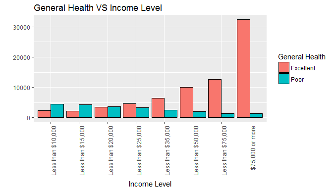
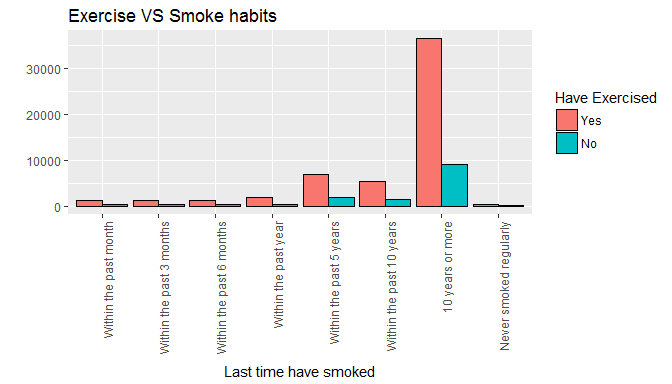
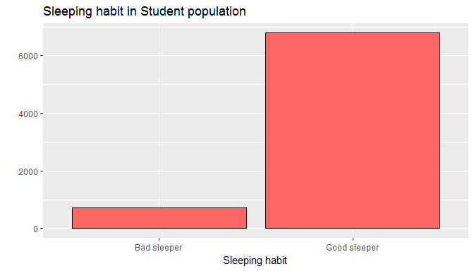

# Exploring the BRFSS data

## Setup

### Load packages


```r
library(ggplot2)
library(dplyr)
```

### Load data

Make sure your data and R Markdown files are in the same directory. When loaded
your data file will be called `brfss2013`. Delete this note when before you submit 
your work. 


```r
load("brfss2013.RData")
```


* * *

## Part 1: Data
The Behavioral Risk Factor Surveillance System (BRFSS) collected health over the years by the states following the BRFSS protocols and questionnaries. Stated could have chosen to hire somebody to do the calling to collect the data, but no matter how the process was done the protocols were followed as set by BRFSS.
This method allowed consistenty over all of the states' information to be able to compare and conjugate the data available nationwide. 

* * *

## Part 2: Research questions

**Research quesion 1:**
It is often said that rich people have better health coverage. I am curious to know what health "level" people with low income have. Find this by exploring the relationship between general health status and income level.


**Research quesion 2:**
Tobacco and alcohol are two health hazards. Considering people who have exercise or not in the last past 30 days, is there any association between smokers and drinkers? Find this association between this interval based in their recent exercise activity.


**Research quesion 3:**
Among the student population, I think that people who take more exercises have better sleep at night. If we define "good sleep" as people who slept more than 5 hours a day. We can see the relation among sleeping hours per day and exercise times and minutes spent among the student population.  


* * *

## Part 3: Exploratory data analysis


**Research quesion 1:**
The variables are "genhlth" which indicates the general health status; and "income2", representing income level. The first thing to do is to remove the NA values from the income2 data. Group them by these variables in two different tables, one showing the lowest values (this is the poor general health with less income) and the other the highest values (this is the excellent general health with the more income)


```r
poor_health <- brfss2013 %>% filter(genhlth == "Poor" & income2!= "NA") %>% group_by(genhlth, income2) %>% summarise(count=n()) %>% arrange(desc(genhlth))

poor_health
```

```
## # A tibble: 8 x 3
## # Groups:   genhlth [1]
##   genhlth           income2 count
##    <fctr>            <fctr> <int>
## 1    Poor Less than $10,000  4513
## 2    Poor Less than $15,000  4311
## 3    Poor Less than $20,000  3674
## 4    Poor Less than $25,000  3268
## 5    Poor Less than $35,000  2575
## 6    Poor Less than $50,000  2058
## 7    Poor Less than $75,000  1421
## 8    Poor   $75,000 or more  1296
```

```r
excellent <- brfss2013 %>% filter(genhlth == "Excellent" & income2!= "NA") %>% group_by(genhlth, income2) %>% summarise(count=n()) %>% arrange(genhlth, desc(income2))

excellent
```

```
## # A tibble: 8 x 3
## # Groups:   genhlth [1]
##     genhlth           income2 count
##      <fctr>            <fctr> <int>
## 1 Excellent   $75,000 or more 32343
## 2 Excellent Less than $75,000 12701
## 3 Excellent Less than $50,000  9972
## 4 Excellent Less than $35,000  6521
## 5 Excellent Less than $25,000  4719
## 6 Excellent Less than $20,000  3551
## 7 Excellent Less than $15,000  2128
## 8 Excellent Less than $10,000  2319
```


```r
ggplot(rbind(excellent, poor_health), aes(x=income2, y=count, fill=factor(genhlth))) + geom_bar(stat = "identity", position = "dodge",  colour = "black") + scale_fill_discrete(name="General Health") + xlab("Income Level") + ylab("") + theme(axis.text.x = element_text(angle= 90, hjust = 1)) + labs(title="General Health VS Income Level")
```

<!-- -->

This graph shows us clearly that the health status "Excellent" and "Poor" comparison. There is a positive association between income level and the number of people based on their General Health. Also, there is a negative relation between these two variables. 
We can conclude that clearly the more the income the more the general health.


**Research quesion 2:**

Variables here are "exerany2" which make the first grouping from people who have exercised in the past 30 days and those who haven't. "lastsmk2", shows how long has it been since the person smoked. "drnk3ge5", how many times during the last 30 days have a person drunk on an occasion. Lastly, "avedrnk2", average of alcoholic drinks per day in the last 30 days. 
First thing to do is to group our information to clearly show my concern between those who have exercised and those who haven't. Second, remove the NA values. And within each table group by last time since they smoked. Here we calculate the total count, mean of drinks and mean of times of consumption for each sub-group.

NOTE: I am showing two columns that might now be necessary later, but I was curious to know how much they have drunk lately.


```r
yes_exer <- brfss2013 %>%
  filter(exerany2 == "Yes" & !is.na(lastsmk2) & !is.na(drnk3ge5) & !is.na(avedrnk2)) %>% group_by(exerany2, lastsmk2) %>%
  summarise(count=n(),bingedrinkMean=mean(drnk3ge5),averageAlcohol=mean(avedrnk2 ))

yes_exer
```

```
## # A tibble: 8 x 5
## # Groups:   exerany2 [?]
##   exerany2                 lastsmk2 count bingedrinkMean averageAlcohol
##     <fctr>                   <fctr> <int>          <dbl>          <dbl>
## 1      Yes    Within the past month  1336      2.1841317       3.118263
## 2      Yes Within the past 3 months  1340      1.7238806       2.855224
## 3      Yes Within the past 6 months  1315      1.5749049       2.710266
## 4      Yes     Within the past year  2021      1.6170213       2.682830
## 5      Yes  Within the past 5 years  6950      1.2835971       2.427770
## 6      Yes Within the past 10 years  5485      1.0747493       2.241750
## 7      Yes         10 years or more 36610      0.6532915       1.807020
## 8      Yes   Never smoked regularly   478      0.8033473       1.891213
```

```r
no_exer <- brfss2013 %>%
  filter(exerany2 == "No" & !is.na(lastsmk2) & !is.na(drnk3ge5) & !is.na(avedrnk2)) %>% group_by(exerany2, lastsmk2) %>%
  summarise(count=n(),bingedrinkMean=mean(drnk3ge5),averageAlcohol=mean(avedrnk2 ))

no_exer
```

```
## # A tibble: 8 x 5
## # Groups:   exerany2 [?]
##   exerany2                 lastsmk2 count bingedrinkMean averageAlcohol
##     <fctr>                   <fctr> <int>          <dbl>          <dbl>
## 1       No    Within the past month   384      2.3333333       3.466146
## 2       No Within the past 3 months   313      1.6230032       2.980831
## 3       No Within the past 6 months   365      1.8547945       2.734247
## 4       No     Within the past year   505      1.5524752       2.706931
## 5       No  Within the past 5 years  1865      1.5678284       2.529759
## 6       No Within the past 10 years  1483      1.2643291       2.238705
## 7       No         10 years or more  9186      0.8642499       1.909754
## 8       No   Never smoked regularly   112      1.2678571       2.151786
```

Based on this last note and before jumping to my main conclusion, will mention that the more time have passed from the last time smoked has a relationship for less the alcohol consumption. This is that the people who was smoking ten years ago was drinking less. More frequent smokers are drinking more. 


```r
ggplot(rbind(yes_exer, no_exer), aes(x=lastsmk2, y=count, fill=factor(exerany2))) + geom_bar(stat = "identity", position = "dodge",  colour = "black") + scale_fill_discrete(name="Have Exercised") + xlab("Last time have smoked") + ylab("") + theme(axis.text.x = element_text(angle= 90, hjust = 1)) + labs(title="Exercise VS Smoke habits")
```

<!-- -->

First thing to notice in this graph is that not all of the data from the two previous tables are shown. 
Here is why. Contrary to what I was expecting, people who have exercised lately have still the smoking habit. The good thing is that the relation has decreased over the recent frequency. This means that people who was smoking 10 years or more have exercised lately which is a good thing, right? You would expect to have a positive impact by having an exercise habit. 


**Research quesion 3:**

Variables: "sleptim1", how much sleep do you have on average? "employ1", employment status. "exerhmm1", how many minutes did you usually keep at exercising? "exeroft1", how many times did you exercise recently?
Again, remove "NA". Group our group of interest which is the student population. Defining "Good Sleeper/Bad Sleeper" if the person has slept more than 5 hours. 


```r
sleeper <- brfss2013 %>% mutate(goodsleeper=ifelse(sleptim1 > 5,"Good sleeper","Bad sleeper")) %>%
  filter(employ1=="A student" & !is.na(goodsleeper) & !is.na(exerhmm1) & !is.na(exeroft1) &exeroft1<= 200) %>%
  group_by(employ1, goodsleeper) %>%
  summarise(count=n(),exerciseMinutesMean=mean(exerhmm1),exerciseTimesMean=mean(exeroft1))

ggplot(sleeper, aes(x=goodsleeper, y=count)) + geom_bar(stat = "identity", position = "dodge",  colour = "black", fill= "#FF6666") + xlab("Sleeping habit") + ylab("")  + labs(title="Sleeping habit in Student population")
```

<!-- -->

Now I will show the other way around, from this graph we can see that there is a clear and very good relation between the good sleepers and the student population. But before we jump to conclusion we need more information to answer my concern which is exercise. The bars are counting the number of people who have exercise. And for this we need the table. 
So far, we can see that among the student population there are clearly more good sleeper. 


```r
sleeper
```

```
## # A tibble: 2 x 5
## # Groups:   employ1 [?]
##     employ1  goodsleeper count exerciseMinutesMean exerciseTimesMean
##      <fctr>        <chr> <int>               <dbl>             <dbl>
## 1 A student  Bad sleeper   723            109.0664          104.2476
## 2 A student Good sleeper  6785             95.1210          103.9636
```

This table shows two more columns: exercise mean and times of exercise.
Regardless the sleeping habit, students have exercised a very similar number of times in the last month. And in average, about 14 less those who are considered to be good sleepers. 
There is no evidence that this statistic is due to chance or biases' reasons. 
